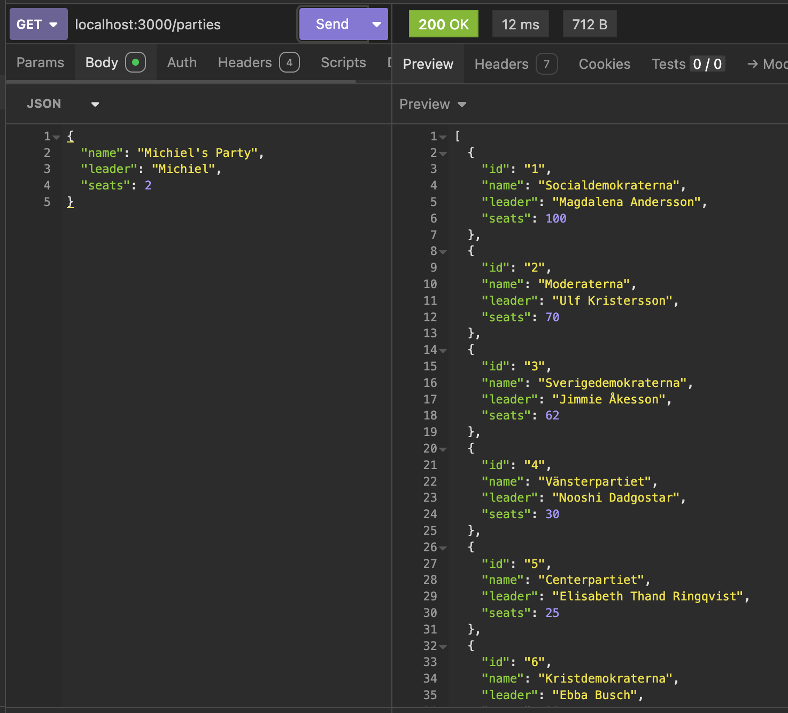
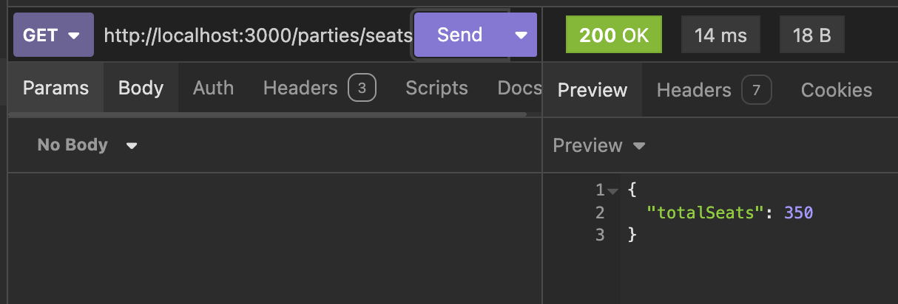
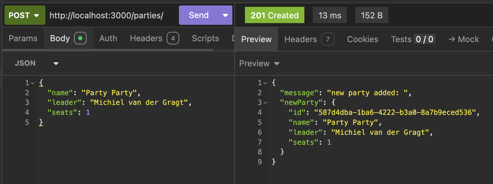
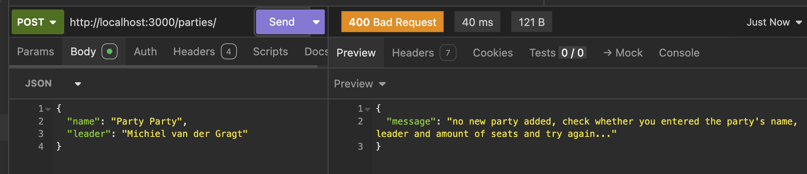
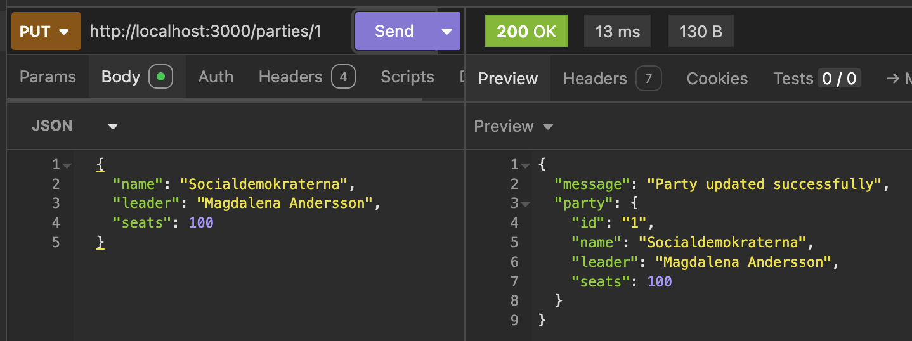
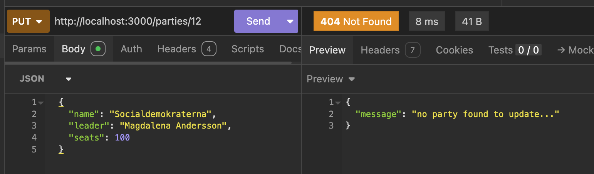

# Parties API

A simple REST API built with **Express.js** and **TypeScript** for managing Swedish political parties.

The server runs on:

`http://localhost:3000`

## Routes

### 1. Get all parties

**Method:** `GET`
**Path:** `/parties`

**Request body:** None

**Description:**
Returns a list of all parties currently stored in the API.

**Success response: `200 OK`**

```json
[
  {
    "id": "1",
    "name": "Socialdemokraterna",
    "leader": "Magdalena Andersson",
    "seats": 99
  },
  {
    "id": "2",
    "name": "Moderaterna",
    "leader": "Ulf Kristersson",
    "seats": 70
  }
]
```

**Status codes tested in Insomnia:**

- `200 OK` — successfully returned all parties.

**Insomnia screenshot:**


---

### 2. Get total number of seats

**Method:** `GET`
**Path:** `/parties/seats-total`

**Request body:** None

**Description:**
Calculates and returns the total number of seats held by all parties.

**Success response: `200 OK`**

```json
{
  "totalSeats": 349
}
```

**Status codes tested in Insomnia:**

- `200 OK` — successfully returned the total number of seats.

**Insomnia screenshot:**


---

### 3. Add a new party

**Method:** `POST`
**Path:** `/parties`

**Request body:**

```json
{
  "name": "Example Party",
  "leader": "Example Leader",
  "seats": 10
}
```

**Description:**
Creates a new party. The API automatically generates a unique ID using `crypto.randomUUID()`.

**Success response: `201 Created`**

```json
{
  "message": "new party added: ",
  "newParty": {
    "id": "generated-uuid",
    "name": "Example Party",
    "leader": "Example Leader",
    "seats": 10
  }
}
```

**Error case tested in Insomnia: `200 OK`**

If the request is missing the party name, leader, or seats, the API does not add the party and returns:

```json
{
  "message": "no new party added, check whether you entered the party's name, leader and amount of seats and try again..."
}
```

**Status codes tested in Insomnia:**

- `201 Created` — party successfully added.
- `200 OK` — invalid/incomplete request body; no party was added.

**Insomnia screenshots:**





---

### 4. Update a party

**Method:** `PUT`
**Path:** `/parties/:id`

**Request body:**

```json
{
  "name": "Updated Party Name",
  "leader": "Updated Leader",
  "seats": 15
}
```

**Description:**
Finds a party using its ID and updates its name, leader and/or number of seats.

**Example URL:**

`http://localhost:3000/parties/1`

**Success response: `200 OK`**

```json
{
  "message": "Party updated successfully",
  "party": {
    "id": "1",
    "name": "Updated Party Name",
    "leader": "Updated Leader",
    "seats": 15
  }
}
```

**Error response: `404 Not Found`**

If no party exists with the specified ID:

```json
{
  "message": "no party found to update..."
}
```

**Status codes tested in Insomnia:**

- `200 OK` — party successfully updated.
- `404 Not Found` — no party exists with the specified ID.

**Insomnia screenshots:**





---

### 5. Delete a party

**Method:** `DELETE`
**Path:** `/party/:id`

**Request body:** None

**Description:**
Removes the party with the specified ID from the list.

**Example URL:**

`http://localhost:3000/party/8`

**Success response: `200 OK`**

```json
{
  "message": "Party deleted successfully"
}
```
